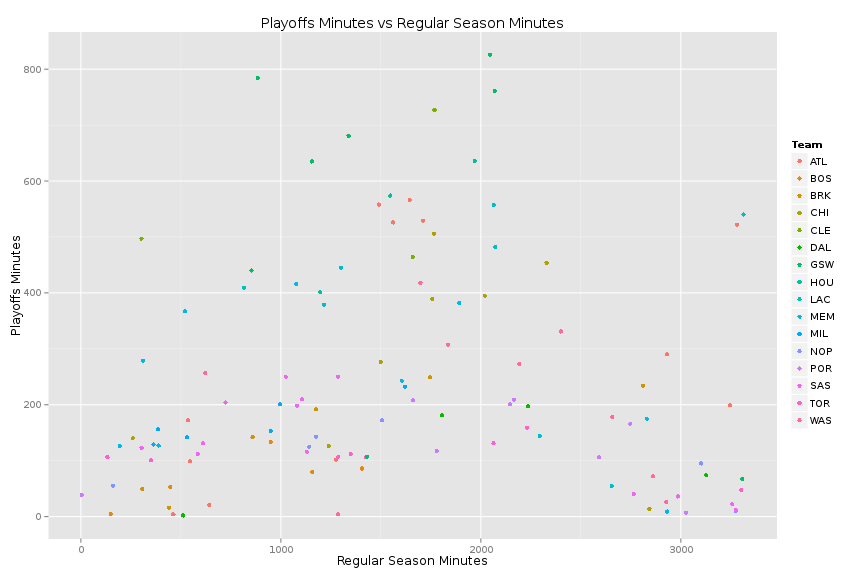
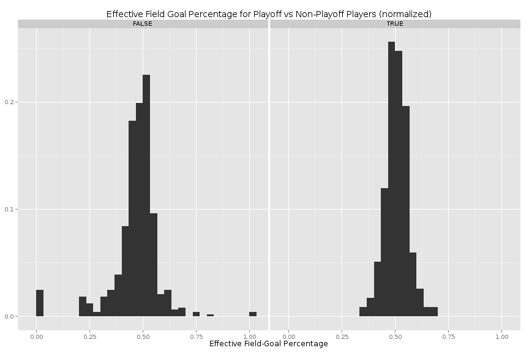
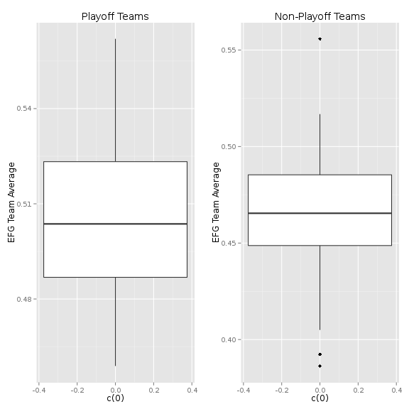

# Project 3 Documentation

## Extract, Transform, and load:

The first step in our project was to load the data onto Oracle in a usable format.
We separated the columns into numerical and non-numerical types, using  3 versions of R\_ETL.R for each csv file. 
Some of the columns were reserved words and.


--------------


## Data Wrangling: 

We made use of some interesting workflows and dplyr joining functions in order to 
combine and wrangle the data into the form needed to produce our
visualizations. 

```
joinedPlayoffsRegular <- regularSeasonDF %>% filter(YR == 2014) %>% inner_join(playOffsSummaryDF, by = c('PLAYER','TM'))
```

Here we select only the year 2014 from the dataset containing only regular season data, so that it will match with the playoff summary data which is only from 2014.
The data is then joined using an inner-join on the player name and team.

```
playersWhoMadeOffSeason <- regularSeasonDF %>% filter(YR == 2014) %>% left_join(playOffsSummaryDF, by = c('PLAYER','TM')) %>% mutate(madePlayoffs=!is.na(POS.y))
```

We make use of left\_join to join the data and generate a new column denoting whether or not players made the playoffs in 2014.

```
semijoinRegular<- regularSeasonDF %>% filter(YR == 2014) %>% semi_join(playOffsSummaryDF, by = c('PLAYER','TM')) %>% group_by(TM) %>% summarise(EFG=mean(as.numeric(as.character(EFG_))))

antijoinRegular<- regularSeasonDF %>% filter(YR == 2014) %>% anti_join(playOffsSummaryDF, by = c('PLAYER','TM')) %>% group_by(TM) %>% summarise(EFG=mean(as.numeric(as.character(EFG_))))
```

These workflows use semi and anti join to get the regular season EFG averages for each team. semi\_join is used to get the stats of teams that
made the playoffs, while anti\_join is used to get the stats of the teams that did not.

--------------

## Results
Our main goal was mostly to compare various statistics of teams/players that made the playoffs to those who did not.


Firstly, we used one of our simpler dataflows to compare playoff minutes to regular season minutes


```r
source("../02\ Data\ Wrangling/innerJoin.R",echo=TRUE)
```

```
## 
## > #regularSeasonDF <- data.frame(fromJSON(getURL(URLencode('129.152.144.84:5001/rest/native/?query="SELECT * from REGULARSEASONS"'),httpheader=c(DB='j .... [TRUNCATED] 
## 
## > ggplot() +
## +   coord_cartesian() + 
## +   scale_x_continuous() +
## +   scale_y_continuous() +
## +   labs(title="Playoffs Minutes vs Regular Season Minutes ..." ... [TRUNCATED]
```

 

This plot displays the interesting trend that players with the most and the fewest 
regular season minutes have the fewest playoff minutes, while those with the most playoff
minutes tend to be close to the average in terms of number of regular season minutes.


Next we plotted histograms of the effective field goal averages of players 
who made the playoffs vs those who did not.


```r
source("../02\ Data\ Wrangling/outerJoin.R",echo=TRUE)
```

```
## 
## > #regularSeasonDF <- data.frame(fromJSON(getURL(URLencode('129.152.144.84:5001/rest/native/?query="SELECT * from REGULARSEASONS"'),httpheader=c(DB='j .... [TRUNCATED] 
## 
## > ggplot(playersWhoMadeOffSeason, aes(x=as.numeric(as.character(EFG_.x))))+
## +   geom_histogram(aes(y=(..count..)/tapply(..count..,..PANEL..,sum)[..PAN .... [TRUNCATED]
```

```
## stat_bin: binwidth defaulted to range/30. Use 'binwidth = x' to adjust this.
## stat_bin: binwidth defaulted to range/30. Use 'binwidth = x' to adjust this.
```

 

Interestingly, it seems that the distributions are quite similar, showing no real 
difference in EFG averages for players who played in the playoffs compared those who did
not, though the distribution for the former appears to be much tighter.


Lastly, we decided to see how this changes when we look at EFG averages for the team, rather than the EFG percentages for each player.


```r
source("../02\ Data\ Wrangling/semiJoin.R",echo=TRUE)
```

```
## 
## > #regularSeasonDF <- data.frame(fromJSON(getURL(URLencode('129.152.144.84:5001/rest/native/?query="SELECT * from REGULARSEASONS"'),httpheader=c(DB='j .... [TRUNCATED] 
## 
## > antijoinRegular<- regularSeasonDF %>% filter(YR == 2014) %>% anti_join(playOffsSummaryDF, by = c('PLAYER','TM')) %>% group_by(TM) %>% summarise(EFG= .... [TRUNCATED] 
## 
## > grid.arrange(
## + ggplot(semijoinRegular, aes(c(0),EFG))+
## +   geom_boxplot()+
## + labs(title='Playoff Teams') +
## +   labs(y="EFG Team Average") ,
## + 
## + gg .... [TRUNCATED]
```

 

As before, there does not appear to be a significant difference in the mean between playoff teams and non-playoff teams.
Interestingly, though, the spread of the distributions seem to be reversed. Teams that did not make the playoffs had more consistent
EFG Averages than those who did.
